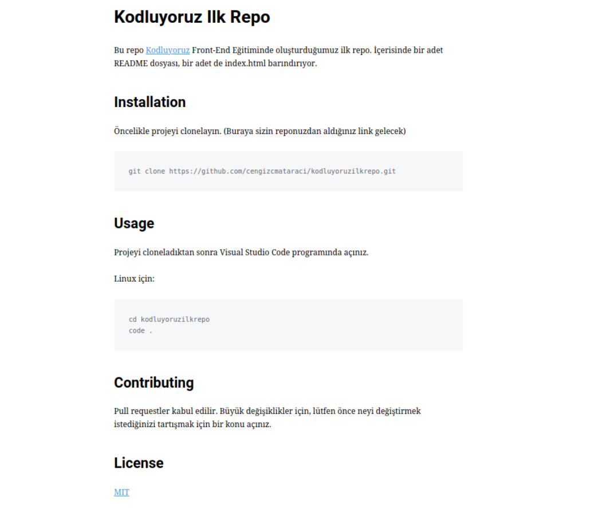

# kodluyoruzilkrepo
Bu repo [Kodluyoruz](https://kodluyoruz.org) Front-End Egitiminde olusturdugumuz ilk repo. Icerisinde  README dosyasi, bir adet de index.html barindiriyor.

## Installation
Oncelikle projeyi clonelayin. (Buraya sizin reponuzdan aldiginiz link gelecek)

```
git clone https://github.com/Aizat111/kodluyoruzilkrepo.git
```
## Usage
Projeyi cloneladiktan sonra Visual Studio Code programinda aciniz
Linux icin:

```
cd kodluyoruzrepo
code .
```
## Contributing
Pull requestler kabul edilir. Buyuk degisiklikler iicn, lutfen once neyi degistirmek istediginizi tartismak icin bir konu aciniz

## License
[MIT](https://choosealicense.com/)


